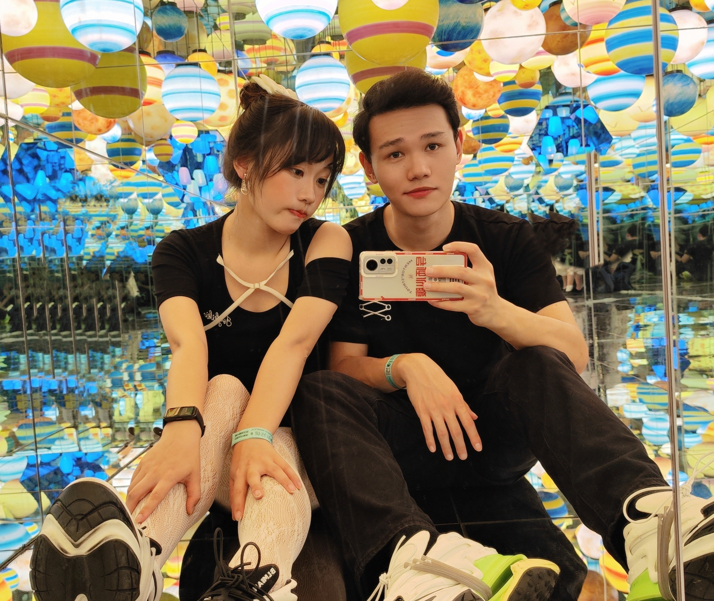

# About Me

Hi! I'm a first-year Ph.D. (23-intake, Fall) at National University of Singapore (Department of Physic, Supervised by [LEE Ching Hua]; and Department of Computer Science, Supervised by [Kenji Kawaguchi]).

I'm interested in a range of topics, mostly and currently in the intersection of: *Complex Networks and Nonlinear Dynamics* (including social and neural phenomena); *AI for Physics* (and potentially Physics for AI); *Non-Hermition Physics*. Moreover, I love to read philosophy, economics, and psychology; wish to study the complex nature in these disciplines in the future.

----
Thanks the support of my dearest love, I'm able to pursue my dream in the field of physics and computer science exempt of future worries.

[LEE Ching Hua]: https://www.physics.nus.edu.sg/faculty/lee-ching-hua/
[Kenji Kawaguchi]: https://ml.comp.nus.edu.sg/kawaguchi

<!-- ---
title: Publications
layout: Page
---

---
title: Resume
layout: Page
--- -->
